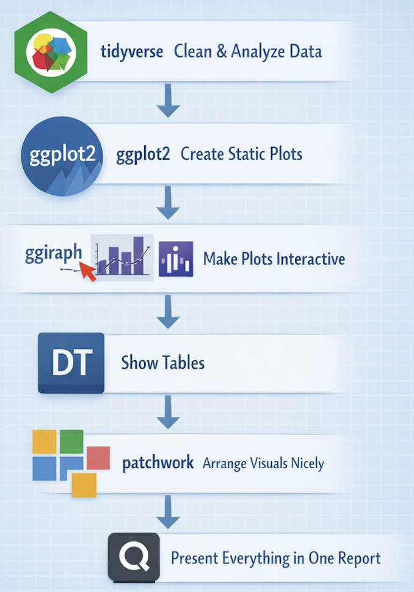

# 3 Programming Interactive Data Visualisation with R

# 3.1 Getting Started

## 3.1.1 Installing and loading the required libraries

In this workshop, we will learn the following libraries.

| Package | Purpose | Key Features |
|----------------|--------------------------|------------------------------|
| **ggiraph** | Add interactivity to ggplot graphics | Tooltips, hover effects, clickable elements, preserves ggplot style |
| **plotly** | Create fully interactive statistical plots | Zoom/pan, hover info, interactive legend, 3D & animated plots, ggplot conversion |
| **DT** | Create interactive tables in HTML | Sorting, searching, pagination, filtering, scrollable tables |
| **tidyverse** | Data science toolkit for R | Data manipulation (`dplyr`), visualization (`ggplot2`), reshaping (`tidyr`), pipe syntax |
| **patchwork** | Combine multiple ggplot charts | Easy layout (`+`, `/`, `\`) |

{width="232"}

The below code chunk is to check if each package is installed. If not, it will install it automatically, and then load all packages into session. So it replaces multiple install.packages() + library() calls.

```{r}
pacman::p_load(ggiraph, plotly, 
               patchwork, DT, tidyverse) 
```

# 3.2 Importing data

The code chunk below uses readr to import Exam_data.csv.

```{r}
exam_data <- read_csv("data/Exam_data.csv")
```

# 3.3 Interactive Data Visualisation - ggiraph methods

ggiraph is a ggplot extension and works very well for HTML reports with the following features.

-   **Tooltip**: a column of data-sets that contain tooltips to be displayed when the mouse is over elements.

-   **Onclick**: a column of data-sets that contain a JavaScript function to be executed when elements are clicked.

-   **Data_id**: a column of data-sets that contain an id to be associated with elements.

## 3.3.1 Tooltip effect with tooltip aesthetic

The code chunk below creates an interactive dot plot of Maths scores using ggiraph, where each dot represents a student and displays their ID when hovered over.

geom_dotplot_interactive() builds a dot plot similar to geom_dotplot(), but adds interactivity.
scale_y_continuous(NULL, breaks = NULL) removes the y-axis label and tick marks for a cleaner look.
girafe() wraps the ggplot object p into an interactive HTML widget.

```{r}
#| eval: false
p <- ggplot(data=exam_data, 
       aes(x = MATHS)) +
  geom_dotplot_interactive(
    aes(tooltip = ID),
    stackgroups = TRUE, 
    binwidth = 1, 
    method = "histodot") +
  scale_y_continuous(NULL, 
                     breaks = NULL)
girafe(
  ggobj = p,
  width_svg = 6,
  height_svg = 6*0.618
)
```

Now we get a compact, interactive dot plot where hovering reveals each student’s ID — ideal for exploratory analysis or dashboards.

# 3.4 Interactivity

By hovering the mouse pointer on an data point of interest, the student’s ID will be displayed.

```{r}
#| echo: false
p <- ggplot(data=exam_data, 
       aes(x = MATHS)) +
  geom_dotplot_interactive(
    aes(tooltip = ID),
    stackgroups = TRUE, 
    binwidth = 1, 
    method = "histodot") +
  scale_y_continuous(NULL, 
                     breaks = NULL)
girafe(
  ggobj = p,
  width_svg = 6,
  height_svg = 6*0.618
)
```

## 3.4.1 Displaying multiple information on tooltip

Let's apply these packages to our exam_data with upgraded interaction.

The code chunk below creates multi-line tooltips with both student name and class (formatted).

```{r}
#| eval: false
exam_data$tooltip <- c(paste0(     
  "Name = ", exam_data$ID,         
  "\n Class = ", exam_data$CLASS)) 

p <- ggplot(data=exam_data, 
       aes(x = MATHS)) +
  geom_dotplot_interactive(
    aes(tooltip = exam_data$tooltip), 
    stackgroups = TRUE,
    binwidth = 1,
    method = "histodot") +
  scale_y_continuous(NULL,               
                     breaks = NULL)
girafe(
  ggobj = p,
  width_svg = 8,
  height_svg = 8*0.618
)
```

# 3.5 Interactivity

By hovering the mouse pointer on an data point of interest, the student’s ID and Class will be displayed.

```{r}
#| echo: false
exam_data$tooltip <- c(paste0(     
  "Name = ", exam_data$ID,         
  "\n Class = ", exam_data$CLASS)) 

p <- ggplot(data=exam_data, 
       aes(x = MATHS)) +
  geom_dotplot_interactive(
    aes(tooltip = exam_data$tooltip), 
    stackgroups = TRUE,
    binwidth = 1,
    method = "histodot") +
  scale_y_continuous(NULL,               
                     breaks = NULL)
girafe(
  ggobj = p,
  width_svg = 8,
  height_svg = 8*0.618
)
```

## 3.5.1 Customising Tooltip style

The code chunk below adds customization.

Color by CLASS → aes(fill = CLASS) gives each class its own color.

Grid removed → theme(panel.grid = element_blank()) for a clean background.

Tooltip styling → white background, bold black text, padding, rounded corners, subtle shadow.

Hover effect → dots change to red with black outline when hovered.

```{r}

tooltip_css <- "
background:white;
font-weight:bold;
color:black;
padding:5px;
border-radius:4px;
"

p <- ggplot(data = exam_data, aes(x = MATHS, fill = CLASS)) +
  geom_dotplot_interactive(aes(tooltip = tooltip),
    stackgroups = TRUE,
    binwidth = 1,
    method = "histodot") +
  scale_y_continuous(NULL, breaks = NULL) +
  theme_minimal(base_size = 12) +   # removes heavy gridlines
  theme(panel.grid = element_blank()) # fully remove grid

# Render with girafe options
girafe(
  ggobj = p,
  width_svg = 8,
  height_svg = 8*0.618,
  options = list(
    opts_tooltip(css = tooltip_css),
    opts_hover(css = "fill:red;stroke:black;") # highlight on hover
  )
)                                       
```

## 3.5.2 Displaying statistics on tooltip

The code chunk below shows us how to embed derived statistics directly into tooltips.
Custom tooltip function shows the mean ± SEM.
stat_summary() creates statistical summary layer and error bars for visual clarity.


```{r}
tooltip <- function(y, ymax, accuracy = .01) {
  mean <- scales::number(y, accuracy = accuracy)
  sem <- scales::number(ymax - y, accuracy = accuracy)
  paste("Mean maths scores:", mean, "+/-", sem)
}

gg_point <- ggplot(data=exam_data, aes(x = fct_reorder(RACE, MATHS, .fun = mean))) +
  stat_summary(aes(y = MATHS, 
                   tooltip = after_stat(  
                     tooltip(y, ymax))),  
    fun.data = "mean_se", 
    geom = GeomInteractiveCol,  
    fill = "light blue") +
 
   stat_summary(aes(y = MATHS),
    fun.data = mean_se,
    geom = "errorbar", width = 0.2, size = 0.2) +
  
  theme_minimal(base_size = 12)

girafe(ggobj = gg_point,
       width_svg = 8,
       height_svg = 8*0.618)
```

fct_reorder(RACE, MATHS, .fun = mean) reorders RACE levels by the mean of MATHS automatically.

## 3.5.3 Hover effect with data_id aesthetic

Elements associated with a data_id (i.e CLASS) will be highlighted in orange color upon mouse over for better visualisation.


```{r}
p <- ggplot(data=exam_data, aes(x = MATHS)) +
  geom_dotplot_interactive(           
    aes(data_id = CLASS),             
    stackgroups = TRUE,               
    binwidth = 1,                        
    method = "histodot") +               
  scale_y_continuous(NULL, breaks = NULL)

girafe(                                  
  ggobj = p,                             
  width_svg = 6,                         
  height_svg = 6*0.618                      
)                                        
```

## 3.5.4 Styling hover effect

Elements associated with a data_id (i.e CLASS) will be changed to dark grey and the rest will be inverse faded in light grey upon mouse over for better visualisation.

```{r}
p <- ggplot(data=exam_data, aes(x = MATHS)) +
  geom_dotplot_interactive(              
    aes(data_id = CLASS),              
    stackgroups = TRUE,                  
    binwidth = 1,                        
    method = "histodot") +               
  scale_y_continuous(NULL, breaks = NULL)

girafe(                                  
  ggobj = p,                             
  width_svg = 6,                         
  height_svg = 6*0.618,
  options = list(                        
    opts_hover(css = "fill: #202020;"),  
    opts_hover_inv(css = "opacity:0.2;") 
  )                                        
)                                        
```

## 3.5.5 Combining tooltip and hover effect

Now let's add both hover highlighting and inverse fading to interactive dot plot.

```{r}
p <- ggplot(data=exam_data, aes(x = MATHS)) +
  geom_dotplot_interactive(              
    aes(tooltip = CLASS, 
        data_id = CLASS),              
    stackgroups = TRUE,                  
    binwidth = 1,                        
    method = "histodot") +               
  scale_y_continuous(NULL, breaks = NULL)

girafe(                                  
  ggobj = p,                             
  width_svg = 6,                         
  height_svg = 6*0.618,
  options = list(                        
    opts_hover(css = "fill: #202020;"),  
    opts_hover_inv(css = "opacity:0.2;") 
  )                                        
)                                        
```

## 3.5.6 Click effect with onclick

The code chunk below adds click interactivity with onclick in ggiraph while hovering still shows info.

By exam_data$onclick, we are constructing a clickable link for each student ID. This means when a dot is clicked, the browser opens the MOE school finder page with the student’s ID appended.


```{r}
exam_data$onclick <- sprintf("window.open(\"%s%s\")",
"https://www.moe.gov.sg/schoolfinder?journey=Primary%20school",
as.character(exam_data$ID))

p <- ggplot(data=exam_data, aes(x = MATHS)) +
  geom_dotplot_interactive(              
    aes(tooltip = paste("ID:", ID, "Class:", CLASS),onclick = onclick),              
    stackgroups = TRUE,                  
    binwidth = 1,                        
    method = "histodot") +               
  scale_y_continuous(NULL, breaks = NULL)

girafe(                                  
  ggobj = p,                             
  width_svg = 6,                         
  height_svg = 6*0.618,
  options = list(                        
    opts_hover(css = "fill: #202020;"),  
    opts_hover_inv(css = "opacity:0.2;") 
  ) 
)  
```

We can also make the onclick open a local PDF or report instead of a web page. The key is to point the onclick string to the file path or relative path where PDF is stored. 

```{r}
# Construct onclick paths to local PDFs
exam_data$onclick <- sprintf("window.open('%s')",
  file.path("reports", paste0(exam_data$ID, ".pdf"))
)

p <- ggplot(data = exam_data, aes(x = MATHS)) +
  geom_dotplot_interactive(
    aes(onclick = onclick, tooltip = ID),
    stackgroups = TRUE,
    binwidth = 1,
    method = "histodot") +
  scale_y_continuous(NULL, breaks = NULL)

girafe(
  ggobj = p,
  width_svg = 6,
  height_svg = 6*0.618
)
```

Clicking a dot will open the corresponding student’s PDF report in a new tab, turning this plot into a dashboard-style entry point for detailed documents.

## 3.5.7 Coordinated Multiple Views with ggiraph

The code chunk below combines two interactive dot plots side by side with patchwork-style composition and hover effects. 

```{r}
exam_data$tooltip <- paste0("ID: ", exam_data$ID, "\nClass: ", exam_data$CLASS
)

p1 <- ggplot(data=exam_data, aes(x = MATHS)) +
  geom_dotplot_interactive(              
    aes(data_id = ID, tooltip = tooltip),              
    stackgroups = TRUE,                  
    binwidth = 1,                        
    method = "histodot") +  
  coord_cartesian(xlim=c(0,100)) + 
  scale_y_continuous(NULL, breaks = NULL)

p2 <- ggplot(data=exam_data, aes(x = ENGLISH)) +
  geom_dotplot_interactive(              
    aes(data_id = ID,tooltip = tooltip),              
    stackgroups = TRUE,                  
    binwidth = 1,                        
    method = "histodot") + 
  coord_cartesian(xlim=c(0,100)) + 
  scale_y_continuous(NULL, breaks = NULL)

girafe(code = print(p1 + p2), 
       width_svg = 10,
       height_svg = 4,
       options = list(
         opts_hover(css = "fill: #202020;"),
         opts_hover_inv(css = "opacity:0.2;"),
         opts_tooltip(css = "background:white; font-weight:bold; color:black; padding:5px; border-radius:4px;")
         )
       ) 
```

Now we get a side-by-side interactive dashboard: Maths scores on the left, English scores on the right. Hovering highlights a student across both plots, while others fade out. Tooltips show their ID and class.

# 3.6 Interactive Data Visualisation - plotly methods!

Plotly in R gives two main pathways to make your graphics interactive:

1. Using plot_ly() directly to build the plot layer by layer, similar to ggplot2 but with Plotly’s own grammar.
2. Using ggplotly() to convert an existing ggplot2 object into an interactive Plotly graph.

## 3.6.1 Creating an interactive scatter plot: plot_ly() method

Using plot_ly() directly

:::: panel-tabset
## The plot

```{r}
#| echo: false
plot_ly(data = exam_data, 
             x = ~MATHS, 
             y = ~ENGLISH)
```

## The code
::: {style="font-size: 1.4em"}

```{r}
#| eval: false
plot_ly(data = exam_data, 
             x = ~MATHS, 
             y = ~ENGLISH)
```
:::
::::

## 3.6.2 Working with visual variable: plot_ly() method

The code chunk below adds color customization mapping to RACE.

:::: panel-tabset
## The plot

```{r}
#| echo: false
plot_ly(data = exam_data, 
        x = ~ENGLISH, 
        y = ~MATHS, 
        color = ~RACE)
```

## The code
::: {style="font-size: 1.4em"}

```{r}
#| eval: false
plot_ly(data = exam_data, 
        x = ~ENGLISH, 
        y = ~MATHS, 
        color = ~RACE)
```
:::
::::

## 3.6.3 Creating an interactive scatter plot: ggplotly() method

Using ggplotly()

:::: panel-tabset
## The plot

```{r}
#| echo: false
p <- ggplot(data=exam_data, 
            aes(x = MATHS,
                y = ENGLISH)) +
  geom_point(size=1) +
  coord_cartesian(xlim=c(0,100),
                  ylim=c(0,100))
ggplotly(p)
```

## The code
::: {style="font-size: 1.4em"}

```{r}
#| eval: false
p <- ggplot(data=exam_data, 
            aes(x = MATHS,
                y = ENGLISH)) +
  geom_point(size=1) +
  coord_cartesian(xlim=c(0,100),
                  ylim=c(0,100))
ggplotly(p)
```
:::
::::

## 3.6.4 Coordinated Multiple Views with plotly

The creation of a coordinated linked plot by using plotly involves three steps:

highlight_key() of plotly package is used as shared data.
two scatterplots will be created by using ggplot2 functions.
lastly, subplot() of plotly package is used to place them next to each other side-by-side.

:::: panel-tabset
## The plot

```{r}
#| echo: false
d <- highlight_key(exam_data)
p1 <- ggplot(data=d, 
            aes(x = MATHS,
                y = ENGLISH)) +
  geom_point(size=1) +
  coord_cartesian(xlim=c(0,100),
                  ylim=c(0,100))

p2 <- ggplot(data=d, 
            aes(x = MATHS,
                y = SCIENCE)) +
  geom_point(size=1) +
  coord_cartesian(xlim=c(0,100),
                  ylim=c(0,100))
subplot(ggplotly(p1),
        ggplotly(p2))
```

## The code
::: {style="font-size: 1.4em"}

```{r}
#| eval: false
d <- highlight_key(exam_data)
p1 <- ggplot(data=d, 
            aes(x = MATHS,
                y = ENGLISH)) +
  geom_point(size=1) +
  coord_cartesian(xlim=c(0,100),
                  ylim=c(0,100))

p2 <- ggplot(data=d, 
            aes(x = MATHS,
                y = SCIENCE)) +
  geom_point(size=1) +
  coord_cartesian(xlim=c(0,100),
                  ylim=c(0,100))
subplot(ggplotly(p1),
        ggplotly(p2))
```
:::
::::

# 3.7 Interactive Data Visualisation - crosstalk methods!

Crosstalk is an add-on to the htmlwidgets package. It extends htmlwidgets with a set of classes, functions, and conventions for implementing cross-widget interactions (currently, linked brushing and filtering).

## 3.7.1 Interactive Data Table: DT package

Data objects in R can be rendered as HTML tables using the JavaScript library ‘DataTables’ (typically via R Markdown or Shiny). 

The code chunk below creates a table where:

1. Columns are sortable.

2. Rows can be searched, filtered and highlighted on hover.

3. Pagination is automatically added.

4. The compact style makes it easier to fit more rows on screen.

```{r}
DT::datatable(exam_data, class= "compact hover", selection = "single")
```

## 3.7.2 Linked brushing: crosstalk method

highlight_key(exam_data) wraps the dataset so that both plotly and DT can share the same selection state. 
crosstalk::bscols() places the plot and table side by side in a responsive layout.

:::: panel-tabset
## The plot

```{r}
#| echo: false
d <- highlight_key(exam_data) 
p <- ggplot(d, 
            aes(ENGLISH, 
                MATHS)) + 
  geom_point(size=1) +
  coord_cartesian(xlim=c(0,100),
                  ylim=c(0,100))

gg <- highlight(ggplotly(p),        
                "plotly_selected")  

crosstalk::bscols(gg,               
                  DT::datatable(d), 
                  widths = 5)        
```

## The code
::: {style="font-size: 1.4em"}

```{r}
#| eval: false
d <- highlight_key(exam_data) 
p <- ggplot(d, 
            aes(ENGLISH, 
                MATHS)) + 
  geom_point(size=1) +
  coord_cartesian(xlim=c(0,100),
                  ylim=c(0,100))

gg <- highlight(ggplotly(p),        
                "plotly_selected")  

crosstalk::bscols(gg,               
                  DT::datatable(d), 
                  widths = 5)        
```
:::
::::

# 3.8 Reflection

Overall, this session gave me a deeper appreciation on how interactivity transforms data visualization. 

Key Takeaways

Interactivity adds context: Tooltips and hover effects make plots more informative without cluttering the design.

Design matters: Clean layouts, styled tooltips, and consistent scales improve readability.

Integration is powerful: Linking plots and tables (via crosstalk) creates dashboards that support both exploration and detail.

Flexibility of tools: ggiraph excels at embedding interactivity in ggplot2, while plotly offers a broader ecosystem for web-ready graphics.
